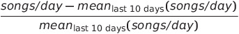

# Sparkify Churn Predictions

## Business Understanding:
The project goal is to develop a model to predict the churn of users of the ficticious music streaming platform Sparkify. Sparkify is a subscription based music streaming platform similar to Spotify. Churn is defined by users cancelling their subscriptions. The goal of the project is to predict which users are more likely to churn using the data they generate.

## Data Understanding
The data comes in a large dataset (12 GB). It is a log of the user interactions with the Sparkify platform. The data is organized in the following structure:

Most interesting for the analysis are the following columns:
1) userId: a unique userId that allows to idenfity every user in the dataset
2) page: a description of the user interaction with the service, such as "NextSong" for playing another song, "Cancellation Confirmed" for cancelling their subscription or "Advert Rolled", to indicate that the user has been served an advert.
3) status: an indicator whether a user is a "free" user or a "paid" user.
4) ts: a timestamp of the user interactions

To understand the data and the service, I create dashboard style KPIs:
1) Monthly unique active users:  

2) Monthly unique free users:  

3) Monthly unique paid users:  

4) Advertisements per month:  

5) Upgrades from "free" to "paid" per month:  
  
6) Percentage of users that churn per month:  

## Data Preparation 
The data is cleaned, such that interactions without userId are removed (mostly described interactions of users before logging into the service). Then I create features to train a churn prediction model. First, for the users that actually churn, I determine the churn date. For the users that do not churn, I determine the largest date in the dataset. For both groups, I consider data for 10 days before these events. I restrict data to a timeframe of 10 days before the churn events, as it should capture the recent experience of the user with the service and therefore the events that cause a user to churn. I then create the following features:

1) **song_per_user_day_norm** :   
The feature is calculated as:

  

This feature describes how much a user has been listening to songs on Sparkify during the last 10 days in a percentage of the 10 day average. If on a given day, the user has been listening to an exactly average amount of songs, the feature equals 0. If a user has been listening to a below average amount of songs, the feature is negative. If a user has been listening to an abover average amount of songs, the feature is positive.

2) **adverts/song**: describes how many adverts a user has had to listen to per song on each given day for the last 10 days
3) **thumbs down/song**: describes how many thumbs down a user has given per song on each given day for the last 10 days 
4) **thumbs up/song**:  describes how many thumbs up a user has given per song on each given day for the last 10 days
5) **downgrade_page_per_user_day**: describes how many times a user has visited the "downgrade" page on each given day for the last 10 days. Before a user can cancel their subscription, they have to visit this page.

After feature creation, the date is transformed into the correct shape to use in the machine learning algorithm.

## Modelling
I perform a test-train split. 70% of the data are randomly split into a training set. The remaining 30% of the data are split into a testing set. I train a RandomForest model to classify users into the binary categories "churn" or "no churn". 

## Evaluation
The model is evaluated on the training and the testing set. For the training set the results are:
|Training|1 Node|2 Nodes|4 Nodes| 
|--|--|--|--|
|Weighted Precision|0.81||||
|Weighted Recall|0.78||||
|Weighted F-Measure|0.69||||

|Testing|1 Node|2 Nodes|4 Nodes| 
|--|--|--|--|
|Weighted Precision|0.81||||
|Weighted Recall|0.78||||
|Weighted F-Measure|0.69||||

As a main metric for the evaluation of the model, I consider the F1 score, due to the relative imbalanace in the data set: the amount of users that do not churn largely outnumbers the amount of users that churn. This is highlighted in the "Percentage of users that churn per month" KPI.

## Deployment
To run the project, the Jupyter notebook "Sparkify.ipynb" needs to be deployed into a AWS EMR instance that runs spark.

### Libraries / Services and Data
The following libraries have been used in the project:
1) PySpark
2) Pandas
3) Matplotlib
4) sklearn

The project has been deployed on AWS. The data has been provided by Udacity as part of the Data Scientist Nanodegree Program.
	
